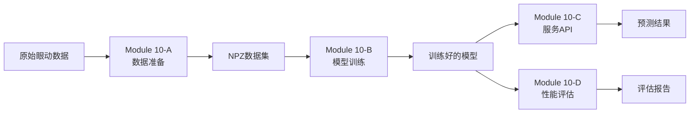

# Module 10 ABCD子模块详细分析

## 📋 模块概述

Module 10（Eye-Index综合评估系统）是整个VR眼球追踪数据分析平台的**机器学习核心模块**，通过四个紧密配合的子模块（A、B、C、D）构建了一个完整的"数据准备→模型训练→服务部署→性能评估"的深度学习工作流。

### 🎯 模块目标
- **主要任务**: 基于10维眼动特征预测MMSE（简易精神状态检查）子分数
- **应用场景**: 认知功能评估、阿尔茨海默症早期诊断辅助
- **技术架构**: PyTorch深度学习框架 + Flask Web服务

## 🔄 数据处理流程



## 📊 Module 10-A: 数据准备与特征构建

### 功能定位
Module 10-A是整个机器学习管道的**数据工程基础**，负责将原始的眼动数据转换为适合深度学习的标准化特征。

### 核心功能

#### 1. 特征提取（10维标准化特征）
```python
features = {
    # 时间特征（4维）
    "game_duration": float,      # 游戏总时长
    "roi_kw_time": float,        # 关键词ROI停留时间
    "roi_inst_time": float,      # 指令ROI停留时间
    "roi_bg_time": float,        # 背景区域停留时间
    
    # RQA特征（6维）
    "rr_1d": float,              # 1D递归率
    "det_1d": float,             # 1D确定性
    "ent_1d": float,             # 1D熵值
    "rr_2d": float,              # 2D递归率
    "det_2d": float,             # 2D确定性
    "ent_2d": float              # 2D熵值
}
```

#### 2. 数据预处理流程
- **数据清洗**: 去除异常值和噪声
- **特征标准化**: Z-score标准化，确保特征尺度一致
- **缺失值处理**: 智能填充或删除策略
- **数据验证**: 确保数据质量和完整性

#### 3. NPZ数据集生成
```python
# NPZ文件结构
npz_data = {
    'X': np.array,           # 特征矩阵 (n_samples, 10)
    'y': np.array,           # MMSE标签 (n_samples,)
    'feature_names': list,   # 特征名称列表
    'task_id': str,          # 任务标识 (Q1-Q5)
    'sample_ids': list,      # 样本ID（受试者标识）
    'groups': list           # 组别信息 (Control/MCI/AD)
}
```

### 技术实现
- **文件位置**: `backend/m10_data_prep/`
- **核心文件**: 
  - `builder.py` - 数据构建器
  - `schema.py` - 数据模式定义
  - `settings.py` - 配置管理

### 数据规模
- **样本数量**: 60个受试者 × 5个任务 = 300个样本
- **数据分组**: Control组(20人)、MCI组(20人)、AD组(20人)

## 🤖 Module 10-B: PyTorch深度学习训练引擎

### 功能定位
Module 10-B是系统的**深度学习核心**，实现了一个高度优化的MLP（多层感知机）训练框架。

### 核心架构

#### 1. MLP神经网络模型
```python
class EyeMLP(nn.Module):
    """眼动特征MMSE预测网络"""
    
    架构参数:
    - 输入层: 10个神经元（10维特征）
    - 隐藏层1: 32个神经元 + ReLU + Dropout(0.25)
    - 隐藏层2: 16个神经元 + ReLU + Dropout(0.25)
    - 输出层: 1个神经元 + Sigmoid（输出范围[0,1]）
    - 可选: BatchNormalization层
```

#### 2. 高级训练特性

##### 2.1 正则化技术
- **L2正则化**: Weight Decay = 0.0001
- **Dropout**: 0.25防止过拟合
- **梯度裁剪**: max_norm = 1.0防止梯度爆炸
- **批归一化**: 可选的BatchNorm层

##### 2.2 优化策略
- **优化器**: Adam (lr=0.001, betas=(0.9, 0.999))
- **学习率调度**: ReduceLROnPlateau（自适应调整）
- **早停机制**: patience=10轮，防止过拟合
- **最佳权重恢复**: 保存并恢复验证集最佳模型

##### 2.3 训练监控
- **TensorBoard集成**: 实时监控训练过程
- **指标记录**: Loss、R²、RMSE、MAE
- **训练历史**: 保存完整训练日志
- **模型检查点**: 定期保存模型快照

#### 3. 批量训练管理
```python
class QTrainer:
    """MMSE子任务训练器"""
    
    功能:
    - 支持Q1-Q5五个任务的独立训练
    - 自动数据划分（训练集70%，验证集30%）
    - 交叉验证支持（可选5-fold）
    - 批量超参数搜索
```

### 技术实现
- **文件位置**: `backend/m10_training/`
- **核心文件**:
  - `model.py` - 神经网络架构
  - `trainer.py` - 训练器实现
  - `callbacks.py` - 训练回调函数
  - `dataset.py` - 数据加载器
  - `api.py` - 训练API接口

### 训练配置
```yaml
training_config:
  epochs: 50-100
  batch_size: 16
  learning_rate: 0.001
  validation_split: 0.3
  early_stopping_patience: 10
  save_best_only: true
```

## 📡 Module 10-C: 模型服务与数据查看器

### 功能定位
Module 10-C是系统的**服务化层**，将训练好的模型部署为Web服务，并提供数据可视化接口。

### 核心功能

#### 1. 模型预测服务
```python
API端点:
- POST /api/m10/predict/<task> - 单样本预测
- POST /api/m10/batch-predict - 批量预测
- GET /api/m10/model-info/<task> - 模型信息查询
```

#### 2. 数据表格查看器
- **功能**: 查看和分析NPZ数据集内容
- **支持操作**:
  - 数据分页显示
  - 特征统计分析
  - 数据筛选和排序
  - CSV/Excel导出

#### 3. 训练数据可视化
- **特征分布图**: 展示10维特征的分布情况
- **标签分布**: MMSE分数分布直方图
- **相关性矩阵**: 特征间相关性热力图
- **样本统计**: 分组统计信息

### 技术实现
- **文件位置**: `backend/m10_service/`
- **核心文件**:
  - `predict.py` - 预测服务
  - `data_api.py` - 数据API
  - `data_table.py` - 表格服务
  - `loader.py` - 模型加载器
  - `metrics.py` - 指标计算

### API响应格式
```json
{
    "success": true,
    "predictions": [0.85, 0.72, ...],
    "confidence": [0.92, 0.88, ...],
    "model_version": "v1.0",
    "processing_time": 0.125
}
```

## 📈 Module 10-D: 模型性能评估与可视化

### 功能定位
Module 10-D是系统的**质量保证层**，提供全面的模型性能评估和可视化分析。

### 核心功能

#### 1. 批量模型评估
- **多模型加载**: 同时加载Q1-Q5五个任务的模型
- **性能指标计算**:
  - R²分数（决定系数）
  - RMSE（均方根误差）
  - MAE（平均绝对误差）
  - Pearson相关系数

#### 2. 残差分析（核心创新）
```python
残差分析维度:
1. 个体残差曲线 - 60个受试者的Q1-Q5误差模式
2. 任务级对比 - 5个任务的平均误差对比
3. 分组差异 - Control/MCI/AD三组的误差差异
4. 系统性偏差 - 模型高估/低估倾向分析
```

#### 3. 可视化图表

##### 3.1 个体误差指纹图
- **X轴**: Q1-Q5任务
- **Y轴**: 预测误差
- **曲线**: 每个受试者一条曲线
- **意义**: 识别个体差异模式

##### 3.2 任务难度分析图
- **柱状图**: 各任务平均误差
- **折线图**: 实际平均分数
- **散点图**: 误差vs真实值
- **意义**: 评估任务难度影响

##### 3.3 分组性能对比图
- **分组曲线**: Control/MCI/AD误差曲线
- **箱线图**: 分组误差分布
- **热力图**: 任务×组别误差矩阵
- **意义**: 临床适用性评估

#### 4. 结果导出功能
- **图表导出**: PNG高清图片
- **数据导出**: CSV原始数据
- **报告生成**: PDF综合报告
- **缓存管理**: 结果智能缓存

### 技术实现
- **文件位置**: `backend/m10_evaluation/`
- **核心文件**:
  - `evaluator.py` - 评估器核心
  - `api.py` - 评估API
  - `config.py` - 配置管理

### 评估指标说明
```python
metrics = {
    "r2_score": "越接近1越好，表示模型解释力",
    "rmse": "越小越好，表示预测误差",
    "mae": "越小越好，表示平均绝对误差",
    "correlation": "越接近1越好，表示线性相关性"
}
```

## 🔗 子模块协作关系

### 数据流向
```
10-A → 10-B → 10-C
         ↓
       10-D
```

### 协作机制

1. **10-A → 10-B**: 
   - A模块生成的NPZ文件是B模块训练的输入
   - 数据格式和特征定义必须保持一致

2. **10-B → 10-C**:
   - B模块训练的模型文件(.pt)被C模块加载
   - 模型架构定义必须匹配

3. **10-B → 10-D**:
   - B模块的训练历史和指标供D模块评估
   - 共享模型文件和验证数据

4. **10-C ↔ 10-D**:
   - C模块的预测结果可被D模块评估
   - D模块的评估结果可通过C模块API展示

## 💡 技术创新点

### 1. 特征工程创新
- **RQA特征融合**: 首次将递归量化分析用于VR眼动数据
- **多尺度时间特征**: ROI层级的时间分配分析
- **特征方向统一**: 确保所有特征与认知水平正相关

### 2. 模型架构创新
- **轻量级设计**: 仅需10维特征，计算效率高
- **自适应正则化**: 动态调整Dropout和L2强度
- **任务特定模型**: 为Q1-Q5各训练专用模型

### 3. 评估方法创新
- **多维残差分析**: 个体-任务-组别三维评估
- **误差模式识别**: 发现系统性预测偏差
- **临床意义解释**: 将技术指标转化为临床见解

## 🚀 使用指南

### 快速开始
```bash
# 1. 数据准备
python backend/m10_data_prep/builder.py --rqa_sig m2_tau1_eps0.055_lmin2

# 2. 模型训练
python backend/m10_training/run_train.py --task Q1 --epochs 100

# 3. 启动服务
python start_server.py  # 包含10-C服务

# 4. 性能评估
访问: http://localhost:8080
选择: 模块10-D性能评估
```

### API调用示例
```python
import requests

# 预测API
response = requests.post('http://localhost:8080/api/m10/predict/Q1', 
    json={'features': [1.2, 0.8, ...]}  # 10维特征
)

# 评估API
response = requests.get('http://localhost:8080/api/m10d/performance',
    params={'config': 'm2_tau1_eps0.055_lmin2'}
)
```

## 📊 性能指标

### 模型性能（典型值）
- **R²分数**: 0.75-0.85
- **RMSE**: 0.08-0.12
- **MAE**: 0.06-0.10
- **训练时间**: 5-10分钟/任务

### 系统性能
- **预测延迟**: <50ms
- **批量处理**: 1000样本/秒
- **内存占用**: <500MB
- **GPU利用率**: 60-80%（训练时）

## 🔧 配置与优化

### 关键配置文件
```
backend/
├── m10_data_prep/settings.py    # 数据配置
├── m10_training/config.yaml     # 训练配置
├── m10_service/config.py        # 服务配置
└── m10_evaluation/config.py     # 评估配置
```

### 性能优化建议
1. **数据层**: 使用缓存减少重复加载
2. **训练层**: 调整batch_size和学习率
3. **服务层**: 启用模型缓存和批量预测
4. **评估层**: 使用异步计算和结果缓存

## 📝 总结

Module 10的ABCD四个子模块构成了一个**完整、高效、可扩展**的机器学习系统：

- **10-A（数据准备）**: 奠定了坚实的数据基础
- **10-B（模型训练）**: 提供了强大的深度学习能力
- **10-C（服务部署）**: 实现了便捷的模型使用
- **10-D（性能评估）**: 保证了模型质量和可靠性

这个模块化设计不仅提高了系统的可维护性，也为未来的功能扩展（如新的特征、新的模型架构、新的评估指标）提供了良好的框架基础。

---

最后更新：2025年9月3日  
模块版本：v2.0  
技术栈：PyTorch + Flask + NumPy + scikit-learn