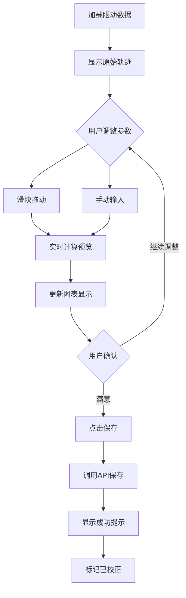

# Module01 眼动数据校正功能设计文档

## 📋 文档信息

**功能名称**: 眼动数据校正 (Gaze Data Calibration)
**目标模块**: Module01 数据可视化
**设计日期**: 2025-10-03
**架构遵循**: Backend/Frontend Coding Standards

---

## 🎯 需求概述

### 功能需求

在Module01数据可视化模块中新增眼动数据校正功能，支持：

1. **位置校正 (Position Calibration)**
   - 支持四个方向的小幅位移调整（上、下、左、右）
   - 手动输入偏移量（精确值）
   - 拖动滑块调整（快速调整）
   - 实时预览校正效果
   - 保存校正后的数据

2. **时间裁剪 (Time Trimming)**
   - 裁剪起始时间（跳过开头N秒）
   - 裁剪结束时间（跳过结尾N秒）
   - 手动输入时间值（精确控制）
   - 拖动滑块调整（快速调整）
   - 实时预览裁剪效果
   - 保存裁剪后的数据

### UI/UX需求

- 校正控制面板集成到现有的背景透明度控制区域
- 布局紧凑，不影响主可视化区域
- 支持双向交互：手动输入 + 滑块拖动
- 实时预览：调整参数立即反映在轨迹图中
- 明确的保存/重置操作

---

## 🏗️ 架构设计

### 系统架构

```
┌─────────────────────────────────────────────────────┐
│              Module01 Frontend                       │
│                                                       │
│  ┌─────────────────────────────────────────┐        │
│  │  GazeTrajectoryChartEnhanced            │        │
│  │                                          │        │
│  │  ┌────────────────────────────────┐    │        │
│  │  │  CalibrationPanel (新增)       │    │        │
│  │  │  - PositionCalibration         │    │        │
│  │  │  - TimeTrimmingCalibration     │    │        │
│  │  └────────────────────────────────┘    │        │
│  │                                          │        │
│  │  ┌────────────────────────────────┐    │        │
│  │  │  Plotly Chart (实时预览)       │    │        │
│  │  └────────────────────────────────┘    │        │
│  └─────────────────────────────────────────┘        │
│                      ↓                                │
│              calibrationService.js (新增)            │
│                      ↓                                │
└──────────────────────┼──────────────────────────────┘
                       ↓
┌──────────────────────┼──────────────────────────────┐
│              Backend API                              │
│                                                       │
│  Module01 API (/api/module01/...)                   │
│                                                       │
│  ┌─────────────────────────────────────────┐        │
│  │  calibration_api.py (新增)              │        │
│  │  - POST /calibrate/position             │        │
│  │  - POST /calibrate/time                 │        │
│  │  - POST /calibrate/save                 │        │
│  └─────────────────────────────────────────┘        │
│                      ↓                                │
│  ┌─────────────────────────────────────────┐        │
│  │  calibration_service.py (新增)          │        │
│  │  - apply_position_offset()              │        │
│  │  - apply_time_trim()                    │        │
│  │  - save_calibrated_data()               │        │
│  └─────────────────────────────────────────┘        │
│                      ↓                                │
│  ┌─────────────────────────────────────────┐        │
│  │  calibration_validator.py (新增)        │        │
│  │  - validate_offset_params()             │        │
│  │  - validate_time_params()               │        │
│  └─────────────────────────────────────────┘        │
│                      ↓                                │
└──────────────────────┼──────────────────────────────┘
                       ↓
              data/02_processed/
              {group}/{subject_id}_{task}_calibrated.csv
```

### 数据流设计

```
用户操作 → 前端组件 → 实时预览计算 → 用户确认 → API调用 → 后端处理 → 数据持久化
   ↓                                                                    ↓
 Slider调整/Input输入                                          保存到calibrated文件
   ↓
 实时预览（前端计算）
```

---

## 📐 详细设计

### 1. 前端组件设计

#### 1.1 CalibrationPanel 组件

**文件位置**: `frontend/src/components/Calibration/CalibrationPanel.jsx`

**Props接口**:
```javascript
interface CalibrationPanelProps {
  data: Array<{x: number, y: number, timestamp: number}>;
  onCalibrate: (calibratedData, calibrationParams) => void;
  onSave: (calibrationParams) => Promise<void>;
  onReset: () => void;
  disabled?: boolean;
}
```

**状态管理**:
```javascript
const [calibrationParams, setCalibrationParams] = useState({
  // 位置偏移
  offsetX: 0,      // 范围: -0.1 ~ 0.1
  offsetY: 0,      // 范围: -0.1 ~ 0.1

  // 时间裁剪
  trimStart: 0,    // 起始裁剪秒数，范围: 0 ~ totalDuration/2
  trimEnd: 0,      // 结束裁剪秒数，范围: 0 ~ totalDuration/2
});

const [isSaving, setIsSaving] = useState(false);
const [previewData, setPreviewData] = useState(null);
```

**UI布局**:
```jsx
<div className="calibration-panel">
  <Divider orientation="left">数据校正</Divider>

  {/* 位置校正 */}
  <div className="position-calibration">
    <h4>位置校正 (Position)</h4>
    <Row gutter={[8, 8]}>
      <Col span={12}>
        <label>X轴偏移:</label>
        <Space>
          <Slider
            min={-0.1}
            max={0.1}
            step={0.001}
            value={calibrationParams.offsetX}
            onChange={(val) => handleOffsetChange('offsetX', val)}
            style={{ width: 100 }}
          />
          <InputNumber
            size="small"
            min={-0.1}
            max={0.1}
            step={0.001}
            value={calibrationParams.offsetX}
            onChange={(val) => handleOffsetChange('offsetX', val)}
            style={{ width: 70 }}
          />
        </Space>
      </Col>
      <Col span={12}>
        <label>Y轴偏移:</label>
        {/* 同上 */}
      </Col>
    </Row>
  </div>

  {/* 时间裁剪 */}
  <div className="time-trimming">
    <h4>时间裁剪 (Time Trim)</h4>
    <Row gutter={[8, 8]}>
      <Col span={12}>
        <label>起始裁剪 (秒):</label>
        {/* Slider + InputNumber */}
      </Col>
      <Col span={12}>
        <label>结束裁剪 (秒):</label>
        {/* Slider + InputNumber */}
      </Col>
    </Row>
  </div>

  {/* 操作按钮 */}
  <div className="calibration-actions">
    <Space>
      <Button
        type="primary"
        onClick={handleSave}
        loading={isSaving}
      >
        保存校正
      </Button>
      <Button onClick={handleReset}>重置</Button>
      <Tag color="blue">
        已调整: {hasChanges ? '是' : '否'}
      </Tag>
    </Space>
  </div>
</div>
```

**关键逻辑**:
```javascript
// 实时预览计算（前端）
const calculatePreview = useCallback((params) => {
  if (!data || data.length === 0) return null;

  let processed = [...data];

  // 1. 应用位置偏移
  if (params.offsetX !== 0 || params.offsetY !== 0) {
    processed = processed.map(point => ({
      ...point,
      x: point.x + params.offsetX,
      y: point.y + params.offsetY
    }));
  }

  // 2. 应用时间裁剪
  if (params.trimStart > 0 || params.trimEnd > 0) {
    const totalDuration = processed[processed.length - 1].timestamp;
    const startTime = params.trimStart;
    const endTime = totalDuration - params.trimEnd;

    processed = processed.filter(point =>
      point.timestamp >= startTime && point.timestamp <= endTime
    );
  }

  return processed;
}, [data]);

// 参数变化时更新预览
useEffect(() => {
  const preview = calculatePreview(calibrationParams);
  setPreviewData(preview);
  onCalibrate(preview, calibrationParams);
}, [calibrationParams, calculatePreview, onCalibrate]);
```

#### 1.2 GazeTrajectoryChartEnhanced 集成

**修改文件**: `frontend/src/components/Charts/GazeTrajectoryChartEnhanced.jsx`

```jsx
import CalibrationPanel from '../Calibration/CalibrationPanel';

const GazeTrajectoryChartEnhanced = ({ data, ... }) => {
  const [calibratedData, setCalibratedData] = useState(null);
  const [calibrationParams, setCalibrationParams] = useState(null);

  // 使用校正后的数据或原始数据
  const displayData = calibratedData || data;

  const handleCalibrate = useCallback((newData, params) => {
    setCalibratedData(newData);
    setCalibrationParams(params);
  }, []);

  const handleSaveCalibration = async (params) => {
    try {
      await calibrationService.saveCalibration({
        group: metadata.group,
        subject_id: metadata.subject_id,
        task: metadata.task,
        params: params
      });
      message.success('校正数据已保存');
    } catch (error) {
      message.error('保存失败: ' + error.message);
    }
  };

  return (
    <div>
      {/* 原有图表 */}
      <PlotlyChart data={plotData} ... />

      {/* 控制面板区域 */}
      <div style={{ marginTop: 16 }}>
        {/* 原有背景透明度控制 */}
        <div>...</div>

        {/* 新增：校正面板 */}
        <CalibrationPanel
          data={data}
          onCalibrate={handleCalibrate}
          onSave={handleSaveCalibration}
          onReset={() => {
            setCalibratedData(null);
            setCalibrationParams(null);
          }}
        />
      </div>
    </div>
  );
};
```

#### 1.3 前端服务层

**文件位置**: `frontend/src/services/calibrationService.js`

```javascript
import axios from 'axios';

const API_BASE = '/api/module01/calibration';

class CalibrationService {
  /**
   * 保存校正数据
   * @param {Object} payload
   * @param {string} payload.group - 组别
   * @param {string} payload.subject_id - 受试者ID
   * @param {string} payload.task - 任务ID
   * @param {Object} payload.params - 校正参数
   */
  async saveCalibration(payload) {
    const response = await axios.post(`${API_BASE}/save`, payload);
    return response.data;
  }

  /**
   * 获取已保存的校正参数
   */
  async getCalibrationParams(group, subjectId, task) {
    const response = await axios.get(`${API_BASE}/params`, {
      params: { group, subject_id: subjectId, task }
    });
    return response.data;
  }

  /**
   * 加载校正后的数据
   */
  async loadCalibratedData(group, subjectId, task) {
    const response = await axios.get(`${API_BASE}/data`, {
      params: { group, subject_id: subjectId, task }
    });
    return response.data;
  }
}

export const calibrationService = new CalibrationService();
```

---

### 2. 后端设计

#### 2.1 API层设计

**文件位置**: `src/web/modules/module01_data_visualization/calibration_api.py`

```python
"""
眼动数据校正API
Gaze Data Calibration API
"""
from flask import Blueprint, request, jsonify
from src.utils.logger import setup_logger
from .calibration_service import CalibrationService
from .calibration_validator import CalibrationValidator

logger = setup_logger(__name__)

calibration_bp = Blueprint('calibration', __name__, url_prefix='/api/module01/calibration')
calibration_service = CalibrationService()
validator = CalibrationValidator()


@calibration_bp.route('/save', methods=['POST'])
def save_calibration():
    """
    保存校正数据

    Request Body:
    {
        "group": "control",
        "subject_id": "S001",
        "task": "q1",
        "params": {
            "offsetX": 0.01,
            "offsetY": -0.02,
            "trimStart": 0.1,
            "trimEnd": 0.2
        }
    }

    Response:
    {
        "success": true,
        "message": "校正数据已保存",
        "data": {
            "output_file": "path/to/calibrated.csv",
            "points_before": 1000,
            "points_after": 950
        }
    }
    """
    try:
        data = request.get_json()

        # 验证参数
        is_valid, errors = validator.validate_calibration_request(data)
        if not is_valid:
            return jsonify({
                'success': False,
                'message': 'Invalid parameters',
                'errors': errors
            }), 400

        # 执行校正并保存
        result = calibration_service.save_calibrated_data(
            group=data['group'],
            subject_id=data['subject_id'],
            task=data['task'],
            params=data['params']
        )

        return jsonify({
            'success': True,
            'message': '校正数据已保存',
            'data': result
        })

    except FileNotFoundError as e:
        logger.error(f"File not found: {e}")
        return jsonify({
            'success': False,
            'message': '原始数据文件不存在'
        }), 404

    except Exception as e:
        logger.error(f"Save calibration error: {e}", exc_info=True)
        return jsonify({
            'success': False,
            'message': f'保存失败: {str(e)}'
        }), 500


@calibration_bp.route('/params', methods=['GET'])
def get_calibration_params():
    """获取已保存的校正参数"""
    try:
        group = request.args.get('group')
        subject_id = request.args.get('subject_id')
        task = request.args.get('task')

        params = calibration_service.get_saved_params(group, subject_id, task)

        return jsonify({
            'success': True,
            'data': params
        })

    except Exception as e:
        logger.error(f"Get params error: {e}")
        return jsonify({
            'success': False,
            'message': str(e)
        }), 500


@calibration_bp.route('/data', methods=['GET'])
def get_calibrated_data():
    """加载校正后的数据"""
    try:
        group = request.args.get('group')
        subject_id = request.args.get('subject_id')
        task = request.args.get('task')

        data = calibration_service.load_calibrated_data(group, subject_id, task)

        return jsonify({
            'success': True,
            'data': data
        })

    except FileNotFoundError:
        return jsonify({
            'success': False,
            'message': '校正数据不存在'
        }), 404

    except Exception as e:
        logger.error(f"Load calibrated data error: {e}")
        return jsonify({
            'success': False,
            'message': str(e)
        }), 500
```

#### 2.2 服务层设计

**文件位置**: `src/web/modules/module01_data_visualization/calibration_service.py`

```python
"""
眼动数据校正服务
Gaze Data Calibration Service
"""
import json
import pandas as pd
from pathlib import Path
from typing import Dict, List, Tuple, Optional
from datetime import datetime

from config.settings import Config
from src.utils.logger import setup_logger

logger = setup_logger(__name__)


class CalibrationService:
    """眼动数据校正服务"""

    def __init__(self):
        self.data_root = Path(Config.DATA_ROOT)
        self.raw_dir = self.data_root / '01_raw'
        self.processed_dir = self.data_root / '02_processed'

        # 确保目录存在
        self.processed_dir.mkdir(parents=True, exist_ok=True)

    def apply_position_offset(
        self,
        data: pd.DataFrame,
        offset_x: float = 0.0,
        offset_y: float = 0.0
    ) -> pd.DataFrame:
        """
        应用位置偏移

        Args:
            data: 原始数据 (必须包含x, y列)
            offset_x: X轴偏移量
            offset_y: Y轴偏移量

        Returns:
            校正后的数据
        """
        result = data.copy()

        if offset_x != 0:
            result['x'] = result['x'] + offset_x

        if offset_y != 0:
            result['y'] = result['y'] + offset_y

        logger.info(f"Applied position offset: X={offset_x}, Y={offset_y}")
        return result

    def apply_time_trim(
        self,
        data: pd.DataFrame,
        trim_start: float = 0.0,
        trim_end: float = 0.0
    ) -> pd.DataFrame:
        """
        应用时间裁剪

        Args:
            data: 原始数据 (必须包含timestamp列)
            trim_start: 起始裁剪秒数
            trim_end: 结束裁剪秒数

        Returns:
            裁剪后的数据
        """
        if trim_start == 0 and trim_end == 0:
            return data

        result = data.copy()

        # 计算时间范围
        min_time = result['timestamp'].min()
        max_time = result['timestamp'].max()
        total_duration = max_time - min_time

        # 应用裁剪
        start_threshold = min_time + trim_start
        end_threshold = max_time - trim_end

        result = result[
            (result['timestamp'] >= start_threshold) &
            (result['timestamp'] <= end_threshold)
        ].copy()

        # 重置timestamp从0开始
        result['timestamp'] = result['timestamp'] - result['timestamp'].min()

        logger.info(
            f"Applied time trim: start={trim_start}s, end={trim_end}s, "
            f"points: {len(data)} -> {len(result)}"
        )

        return result

    def save_calibrated_data(
        self,
        group: str,
        subject_id: str,
        task: str,
        params: Dict
    ) -> Dict:
        """
        保存校正数据

        Args:
            group: 组别
            subject_id: 受试者ID
            task: 任务ID
            params: 校正参数 {offsetX, offsetY, trimStart, trimEnd}

        Returns:
            保存结果信息
        """
        # 读取原始数据
        raw_file = self.raw_dir / group / f"{subject_id}_{task}.csv"
        if not raw_file.exists():
            raise FileNotFoundError(f"原始数据文件不存在: {raw_file}")

        data = pd.read_csv(raw_file)
        original_points = len(data)

        # 应用校正
        calibrated = data.copy()

        # 1. 位置偏移
        calibrated = self.apply_position_offset(
            calibrated,
            offset_x=params.get('offsetX', 0),
            offset_y=params.get('offsetY', 0)
        )

        # 2. 时间裁剪
        calibrated = self.apply_time_trim(
            calibrated,
            trim_start=params.get('trimStart', 0),
            trim_end=params.get('trimEnd', 0)
        )

        # 保存校正数据
        output_dir = self.processed_dir / group
        output_dir.mkdir(parents=True, exist_ok=True)
        output_file = output_dir / f"{subject_id}_{task}_calibrated.csv"

        calibrated.to_csv(output_file, index=False)

        # 保存校正参数
        params_file = output_dir / f"{subject_id}_{task}_calibration_params.json"
        with open(params_file, 'w', encoding='utf-8') as f:
            json.dump({
                'params': params,
                'metadata': {
                    'subject_id': subject_id,
                    'task': task,
                    'group': group,
                    'calibrated_at': datetime.now().isoformat(),
                    'points_before': original_points,
                    'points_after': len(calibrated)
                }
            }, f, indent=2)

        logger.info(f"Saved calibrated data: {output_file}")

        return {
            'output_file': str(output_file),
            'params_file': str(params_file),
            'points_before': original_points,
            'points_after': len(calibrated)
        }

    def get_saved_params(
        self,
        group: str,
        subject_id: str,
        task: str
    ) -> Optional[Dict]:
        """获取已保存的校正参数"""
        params_file = (
            self.processed_dir / group /
            f"{subject_id}_{task}_calibration_params.json"
        )

        if not params_file.exists():
            return None

        with open(params_file, 'r', encoding='utf-8') as f:
            return json.load(f)

    def load_calibrated_data(
        self,
        group: str,
        subject_id: str,
        task: str
    ) -> List[Dict]:
        """加载校正后的数据"""
        calibrated_file = (
            self.processed_dir / group /
            f"{subject_id}_{task}_calibrated.csv"
        )

        if not calibrated_file.exists():
            raise FileNotFoundError(f"校正数据不存在: {calibrated_file}")

        data = pd.read_csv(calibrated_file)
        return data.to_dict('records')
```

#### 2.3 验证器设计

**文件位置**: `src/web/modules/module01_data_visualization/calibration_validator.py`

```python
"""
校正参数验证器
Calibration Parameter Validator
"""
from typing import Tuple, List


class CalibrationValidator:
    """校正参数验证器"""

    # 位置偏移范围限制
    MAX_OFFSET = 0.1
    MIN_OFFSET = -0.1

    # 时间裁剪范围限制（秒）
    MAX_TRIM_TIME = 60.0
    MIN_TRIM_TIME = 0.0

    @classmethod
    def validate_calibration_request(cls, data: dict) -> Tuple[bool, List[str]]:
        """
        验证校正请求

        Returns:
            (is_valid, error_messages)
        """
        errors = []

        # 必需字段
        required_fields = ['group', 'subject_id', 'task', 'params']
        for field in required_fields:
            if field not in data:
                errors.append(f"Missing required field: {field}")

        if errors:
            return False, errors

        # 验证params
        params = data['params']

        # 验证offsetX
        if 'offsetX' in params:
            offset_x = params['offsetX']
            if not isinstance(offset_x, (int, float)):
                errors.append("offsetX must be a number")
            elif not (cls.MIN_OFFSET <= offset_x <= cls.MAX_OFFSET):
                errors.append(
                    f"offsetX must be between {cls.MIN_OFFSET} and {cls.MAX_OFFSET}"
                )

        # 验证offsetY
        if 'offsetY' in params:
            offset_y = params['offsetY']
            if not isinstance(offset_y, (int, float)):
                errors.append("offsetY must be a number")
            elif not (cls.MIN_OFFSET <= offset_y <= cls.MAX_OFFSET):
                errors.append(
                    f"offsetY must be between {cls.MIN_OFFSET} and {cls.MAX_OFFSET}"
                )

        # 验证trimStart
        if 'trimStart' in params:
            trim_start = params['trimStart']
            if not isinstance(trim_start, (int, float)):
                errors.append("trimStart must be a number")
            elif not (cls.MIN_TRIM_TIME <= trim_start <= cls.MAX_TRIM_TIME):
                errors.append(
                    f"trimStart must be between {cls.MIN_TRIM_TIME} and {cls.MAX_TRIM_TIME}"
                )

        # 验证trimEnd
        if 'trimEnd' in params:
            trim_end = params['trimEnd']
            if not isinstance(trim_end, (int, float)):
                errors.append("trimEnd must be a number")
            elif not (cls.MIN_TRIM_TIME <= trim_end <= cls.MAX_TRIM_TIME):
                errors.append(
                    f"trimEnd must be between {cls.MIN_TRIM_TIME} and {cls.MAX_TRIM_TIME}"
                )

        return len(errors) == 0, errors
```

---

## 🎨 UI/UX设计

### 布局设计

```
┌─────────────────────────────────────────────────────┐
│              眼动轨迹图 (主可视化区域)               │
│                                                      │
│              [Plotly Chart - 实时预览]              │
│                                                      │
└─────────────────────────────────────────────────────┘
┌─────────────────────────────────────────────────────┐
│  控制面板                                            │
│  ┌──────────────────────────────────────────────┐  │
│  │ 背景透明度: [━━━●━━━━━━] 30%                  │  │
│  │ 显示ROI: ☑ 关键词 ☑ 指令 ☐ 背景              │  │
│  └──────────────────────────────────────────────┘  │
│                                                      │
│  ━━━━━━━━━━━━━ 数据校正 ━━━━━━━━━━━━━             │
│                                                      │
│  📍 位置校正 (Position)                             │
│  ┌──────────────────────────────────────────────┐  │
│  │ X轴偏移: [━━━━●━━━━━━] [-0.010]              │  │
│  │ Y轴偏移: [━━━━●━━━━━━] [+0.005]              │  │
│  └──────────────────────────────────────────────┘  │
│                                                      │
│  ⏱ 时间裁剪 (Time Trim)                             │
│  ┌──────────────────────────────────────────────┐  │
│  │ 起始裁剪: [━━●━━━━━━━━] [0.1] 秒             │  │
│  │ 结束裁剪: [━━━━━━━━●━━] [0.2] 秒             │  │
│  └──────────────────────────────────────────────┘  │
│                                                      │
│  [保存校正] [重置] [已调整: 是]                    │
└─────────────────────────────────────────────────────┘
```

### 交互流程



---

## 📊 数据结构设计

### 校正参数格式

```typescript
interface CalibrationParams {
  // 位置偏移
  offsetX: number;      // -0.1 ~ 0.1
  offsetY: number;      // -0.1 ~ 0.1

  // 时间裁剪
  trimStart: number;    // 0 ~ totalDuration/2 (秒)
  trimEnd: number;      // 0 ~ totalDuration/2 (秒)
}
```

### 保存的元数据格式

```json
{
  "params": {
    "offsetX": 0.01,
    "offsetY": -0.02,
    "trimStart": 0.1,
    "trimEnd": 0.2
  },
  "metadata": {
    "subject_id": "S001",
    "task": "q1",
    "group": "control",
    "calibrated_at": "2025-10-03T10:30:00",
    "points_before": 1000,
    "points_after": 950
  }
}
```

### 文件命名规范

```
原始数据:
  data/01_raw/{group}/{subject_id}_{task}.csv

校正数据:
  data/02_processed/{group}/{subject_id}_{task}_calibrated.csv

校正参数:
  data/02_processed/{group}/{subject_id}_{task}_calibration_params.json
```

---

## 🧪 测试策略

### 单元测试

**文件**: `tests/test_calibration_service.py`

```python
import pytest
import pandas as pd
from src.web.modules.module01_data_visualization.calibration_service import CalibrationService

class TestCalibrationService:

    @pytest.fixture
    def service(self):
        return CalibrationService()

    @pytest.fixture
    def sample_data(self):
        return pd.DataFrame({
            'x': [0.1, 0.2, 0.3, 0.4, 0.5],
            'y': [0.1, 0.2, 0.3, 0.4, 0.5],
            'timestamp': [0, 0.1, 0.2, 0.3, 0.4]
        })

    def test_apply_position_offset(self, service, sample_data):
        """测试位置偏移"""
        result = service.apply_position_offset(
            sample_data,
            offset_x=0.01,
            offset_y=-0.02
        )

        assert result['x'].iloc[0] == pytest.approx(0.11)
        assert result['y'].iloc[0] == pytest.approx(0.08)

    def test_apply_time_trim(self, service, sample_data):
        """测试时间裁剪"""
        result = service.apply_time_trim(
            sample_data,
            trim_start=0.1,
            trim_end=0.1
        )

        # 裁剪后应该有3个点
        assert len(result) == 3

        # timestamp应该从0开始
        assert result['timestamp'].min() == 0

    def test_combined_calibration(self, service, sample_data):
        """测试组合校正"""
        result = sample_data.copy()

        # 先偏移
        result = service.apply_position_offset(
            result,
            offset_x=0.05,
            offset_y=0.05
        )

        # 再裁剪
        result = service.apply_time_trim(
            result,
            trim_start=0.1,
            trim_end=0.1
        )

        assert len(result) == 3
        assert result['x'].iloc[0] > 0.15  # 偏移后的值
```

### 集成测试

**文件**: `tests/test_calibration_api.py`

```python
import pytest
from flask import json

@pytest.mark.integration
class TestCalibrationAPI:

    def test_save_calibration(self, client):
        """测试保存校正API"""
        response = client.post('/api/module01/calibration/save', json={
            'group': 'control',
            'subject_id': 'S001',
            'task': 'q1',
            'params': {
                'offsetX': 0.01,
                'offsetY': -0.02,
                'trimStart': 0.1,
                'trimEnd': 0.2
            }
        })

        assert response.status_code == 200
        data = json.loads(response.data)
        assert data['success'] is True
        assert 'output_file' in data['data']

    def test_invalid_params(self, client):
        """测试无效参数"""
        response = client.post('/api/module01/calibration/save', json={
            'group': 'control',
            'subject_id': 'S001',
            'task': 'q1',
            'params': {
                'offsetX': 1.0,  # 超出范围
                'offsetY': 0.0
            }
        })

        assert response.status_code == 400
        data = json.loads(response.data)
        assert data['success'] is False
```

### 前端测试

**文件**: `frontend/src/components/Calibration/__tests__/CalibrationPanel.test.jsx`

```javascript
import { render, screen, fireEvent } from '@testing-library/react';
import CalibrationPanel from '../CalibrationPanel';

describe('CalibrationPanel', () => {
  const mockData = [
    { x: 0.1, y: 0.1, timestamp: 0 },
    { x: 0.2, y: 0.2, timestamp: 0.1 },
  ];

  it('renders all controls', () => {
    render(<CalibrationPanel data={mockData} />);

    expect(screen.getByText('位置校正')).toBeInTheDocument();
    expect(screen.getByText('时间裁剪')).toBeInTheDocument();
  });

  it('updates offset on slider change', () => {
    const onCalibrate = jest.fn();
    render(
      <CalibrationPanel
        data={mockData}
        onCalibrate={onCalibrate}
      />
    );

    const slider = screen.getAllByRole('slider')[0];
    fireEvent.change(slider, { target: { value: 0.05 } });

    expect(onCalibrate).toHaveBeenCalled();
  });
});
```

---

## 📅 实施计划

### Phase 1: 后端开发 (2天)

**Day 1**:
- [ ] 创建calibration_service.py
  - apply_position_offset方法
  - apply_time_trim方法
  - save_calibrated_data方法
- [ ] 创建calibration_validator.py
- [ ] 编写单元测试

**Day 2**:
- [ ] 创建calibration_api.py
  - /save接口
  - /params接口
  - /data接口
- [ ] 注册Blueprint到routes.py
- [ ] 编写API集成测试

### Phase 2: 前端开发 (2天)

**Day 3**:
- [ ] 创建CalibrationPanel组件
  - 基础UI布局
  - 滑块和输入框双向绑定
  - 实时预览计算逻辑
- [ ] 创建calibrationService.js

**Day 4**:
- [ ] 集成到GazeTrajectoryChartEnhanced
- [ ] 样式优化和响应式布局
- [ ] 前端单元测试

### Phase 3: 集成测试与优化 (1天)

**Day 5**:
- [ ] 端到端测试
- [ ] 性能优化（防抖处理）
- [ ] 文档完善
- [ ] 用户验收测试

---

## 🔒 注意事项

### 性能优化

1. **防抖处理**: 滑块调整时使用debounce，避免频繁计算
```javascript
import { debounce } from 'lodash';

const debouncedCalibrate = useMemo(
  () => debounce(calculatePreview, 300),
  [calculatePreview]
);
```

2. **数据缓存**: 缓存原始数据，避免重复加载
3. **计算优化**: 位置偏移和时间裁剪在前端进行，减少API调用

### 数据安全

1. **参数验证**: 前后端双重验证
2. **文件覆盖保护**: 保存前检查是否存在，提示用户
3. **错误处理**: 完善的try-catch和错误提示

### 用户体验

1. **实时反馈**: 参数调整立即显示预览
2. **操作可逆**: 提供重置功能
3. **明确提示**: 保存成功/失败的明确反馈
4. **数据对比**: 可选显示原始vs校正对比

---

## 📚 相关文档

- [Module01开发计划](./MODULE01_DEVELOPMENT_PLAN.md)
- [前端编码规范](./FRONTEND_CODING_STANDARDS.md)
- [后端编码规范](./BACKEND_CODING_STANDARDS.md)
- [测试架构文档](./TESTING_ARCHITECTURE.md)

---

**设计完成时间**: 2025-10-03
**预计实施周期**: 5个工作日
**优先级**: 中
**复杂度**: 中等
